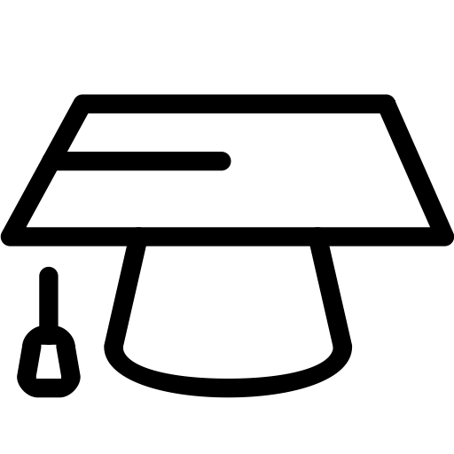

{: .experience_image .center_image}
- I am a 3rd year PhD student in Computational and Mathematical Engineering at Stanford University. My advisor is Professor Eric Darve.
- I received my BS from Yale in 2016, double majoring in Applied Mathematics and Mechanical Engineering.

{: .experience_image .center_image}
- I most recently interned at the [SLAC National Accelerator Laboratory](https://www6.slac.stanford.edu/), working on anomaly detection algorithms to detect failures in the [LCLS](https://lcls.slac.stanford.edu/) beam.
- From 2016-2018, I was a full-time software engineer at Microsoft at their headquarters in Redmond, WA.
- During undergrad, I also interned at [SIG](https://sig.com/), [GE Digital](https://www.ge.com/digital/) (formerly GE Intelligent Platforms), and [CERN](https://home.cern/)'s ATLAS detector.

{: .experience_image .center_image}
- I have at time or another coded in: C, C++, C#, Java, Fortran77, Python 2 & 3, Julia, Javascript/Typescript, R, PHP, SQL, MATLAB, and Visual Basic. I (perhaps optimistically) believe that I can pick any of these back up and hit the ground running.
- I prefer a statically-typed language over a free-for-all language (looking at you Python). Currently I am aggressively pushing Julia on all my friends and colleagues.

See LinkedIn for a more complete profile, or contact me for my resume.
